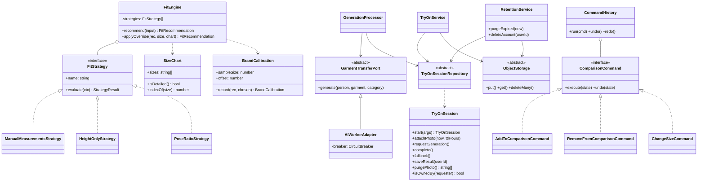

# Vestirse · Probador de ropa virtual

Probador virtual de tres capas, implementado a partir de [`docs/README-virtual-tryon.md`](docs/README-virtual-tryon.md):

| Capa | Qué hace | Dónde corre |
|---|---|---|
| **Cuerpo similar** (por defecto) | Foto real del producto y, sobre 12 modelos reales XS–4XL, la prenda puesta con IA (una vez por modelo y prenda) | Motor de prueba; el resultado queda en el catálogo |
| **Track A · Cámara en vivo** | Pose (MediaPipe) + warp afín del recorte de la foto real sobre el video | 100 % navegador; ningún frame sale del dispositivo |
| **Track B · Con tu foto** | Prueba virtual por difusión (FASHN VTON 1.5 en Hugging Face, con Leffa e IDM-VTON de respaldo; o *mock*) | Cola BullMQ → microservicio Python |
| **Track C · ¿Es mi talla?** | Recomendación con confianza explícita, editable, calibrada por marca | Librería TS pura `packages/fit-engine` |

## Puesta en marcha

Requisitos: Node ≥ 22.12, Python ≥ 3.12, Docker.

```bash
npm install
cp infra/.env.example infra/.env  # HF_TOKEN y GROQ_API_KEY (opcionales, ver abajo)
cp apps/api/.env.example apps/api/.env
npm run infra:up                  # Postgres :55432, Redis :6380, S3 (RustFS) :9000, ai-worker (AI_WORKER_PORT)
npm run build:packages
npm run db:migrate                # aplica migraciones
npm run db:seed                   # 4 marcas, 47 prendas, 12 modelos, usuario admin
npm run dev:api                   # http://localhost:3000/api
npm run dev:web                   # http://localhost:4200
```

Capturas de la app funcionando con el motor real: [`docs/capturas/`](docs/capturas/README.md).

Admin de demo: `admin@vestirse.local` / `admin1234` (cámbialo con `ADMIN_EMAIL` / `ADMIN_PASSWORD` antes del seed).

> Los puertos de Postgres y Redis del host son 55432 y 6380 para no chocar con instalaciones locales.
> Se usa **RustFS** como S3 local porque las imágenes oficiales de MinIO ya no se publican.

### Todo en contenedores (perfil `full`)

```bash
docker compose -f infra/docker-compose.yml --profile full up -d --build
docker compose -f infra/docker-compose.yml exec api npm run db:seed   # la primera vez
# web en http://localhost:8080 (WEB_PORT=... para cambiarlo; AI_WORKER_PORT para el worker)
```

La API aplica las migraciones al arrancar y expone `GET /api/health` (base de datos y Redis críticos;
el worker aparece como `degraded` si no responde, porque la app sigue funcionando con el fallback).
Los secretos por defecto del perfil `full` son solo para desarrollo local.

### Motores de prueba virtual

El motor se elige con `AI_PROVIDER` en `apps/api/.env` (o con `PUT /api/admin/ai-settings`) y viaja al
worker en cada petición (`X-AI-Provider`), así que cambiarlo no requiere reiniciar nada. El contrato
API↔worker está versionado en `contracts/ai-worker/v1/` y ambos lados lo validan en sus tests.

| `AI_PROVIDER` | Motor | Costo |
|---|---|---|
| `hf-chain` (por defecto) | Prueba `hf-fashn`, luego `hf-leffa`, luego `hf-idm`, y pasa al siguiente si uno falla o se queda sin cuota | Gratis |
| `hf-fashn` | [FASHN VTON 1.5](https://huggingface.co/spaces/fashn-ai/fashn-vton-1.5): partes de arriba, de abajo y vestidos; acepta la prenda sola o puesta en una persona | Gratis |
| `hf-leffa` / `hf-idm` | Leffa (todas las categorías) / IDM-VTON (solo partes de arriba) | Gratis |
| `fal-catvton`, `replicate` | APIs de pago; cubiertas con tests de contrato, sin probar contra el proveedor real | De pago |
| `mock` | Pega la prenda sobre la foto, sin IA: para desarrollo y tests | Gratis |

Los motores `hf-*` son Spaces públicos de Hugging Face con **cuota diaria de GPU** (ZeroGPU): unos
2 minutos al día sin token y unos 5 con un token gratuito, compartidos por toda la app (una prueba
gasta ~15–25 s). Crea un token de lectura en <https://huggingface.co/settings/tokens> y ponlo en
`HF_TOKEN` (`infra/.env` o `services/ai-worker/.env`). Por eso cada prueba sobre un modelo del
catálogo se genera una sola vez y queda guardada.

`GROQ_API_KEY` (gratis en <https://console.groq.com>) activa dos ayudas con un modelo de visión
(Groq no genera imágenes): el aviso de encuadre al subir la foto y el etiquetado automático de
prendas en el panel de admin. Sin clave, sin cupo o con error, ambas se omiten y nada se bloquea.

### Fotos del catálogo

Todas las prendas y modelos usan fotos reales de Pexels (créditos en `/creditos`). `seed/photos/sources.json`
dice de qué foto sale cada pieza. Para añadir o cambiar una: descarga el original a
`seed/photos/_raw/{garments,bodies}/<id>.jpg`, apúntalo en `sources.json` y ejecuta:

```bash
cd services/ai-worker
pip install -e ".[tools]"                              # rembg, solo para preparar fotos
python scripts/prepare_catalog.py ../../seed/photos    # fondo claro 768×1024 + recorte para la cámara
```

Desde el panel de admin también se puede dar de alta una prenda con su foto (obligatoria); esas no
tienen recorte, así que no ofrecen la cámara en vivo.

Para que solo la API pueda llamar al worker, define el mismo `WORKER_TOKEN` en `apps/api/.env` y al
levantar la infraestructura (`WORKER_TOKEN=... npm run infra:up`).

## Tests

```bash
npm test                  # fit-engine, shared-types (tipos), api (jest), web (vitest)
npm run test:invariants   # solo las invariantes éticas
cd services/ai-worker && pytest
```

### Invariantes éticas verificadas (sección 4 del documento)

| Regla | Cómo se verifica |
|---|---|
| Nunca obligar a subir foto | Test de tipos: `TryOnSession.uploadedPhotoUrl` debe ser opcional (falla si se vuelve obligatorio) |
| Sin edición/adelgazamiento de silueta | Test que recorre todas las rutas de la API contra un patrón prohibido; `BodyGeometry` solo acepta medidas reales; script estático del cliente |
| Sin comparación entre usuarios | Mismo test de rutas (`leaderboard`, `compare-users`…) |
| Catálogo de cuerpos diverso desde el día 1 | Test del seed (XS–4XL, ≥10 tipos, ≥5 tonos de piel) + el panel admin **rechaza** borrar un cuerpo si rompe la cobertura |
| La talla nunca es certeza | 48 casos: toda recomendación trae confianza y base; el override siempre se acepta |
| Cámara: solo video, siempre se apaga, sin red | Test de `CameraService` + script que prohíbe red en `features/live-overlay` |
| Retención real (sección 8) | Test del cron de TTL y del borrado de cuenta con almacenamiento en memoria; consentimiento `false` por defecto en el esquema |

## Arquitectura

```
apps/web      Angular 21 (standalone, signals, zoneless) · Tailwind 4 · Transloco es/en · PWA
apps/api      NestJS 11 hexagonal · Prisma 7 · BullMQ · Socket.IO · opossum
services/ai-worker   FastAPI · motores de Hugging Face, fal CatVTON, Replicate y mock · visión con Groq
packages/shared-types   modelo de datos canónico (sección 9)
packages/fit-engine     Track C, sin I/O
```

Cada módulo de la API separa `domain/` (entidades y reglas), `application/` (casos de uso y **puertos** como clases abstractas) e `infrastructure/` (adaptadores Prisma, S3, HTTP).

### Patrones de diseño

| Patrón | Dónde |
|---|---|
| **Strategy** | `FitStrategy` (`ManualMeasurementsStrategy`, `HeightOnlyStrategy`, `PoseRatioStrategy`) · `TryOnProvider` en Python (un motor por estrategia) |
| **Adapter** | `AiWorkerAdapter` (puerto `GarmentTransferPort`), `S3ObjectStorage` (puerto `ObjectStorage`), `HfSpaceProvider`, `FalCatVTONProvider`, `ReplicateProvider` |
| **Repository** | `CatalogRepository`, `TryOnSessionRepository`, `CalibrationRepository` con implementaciones Prisma |
| **Facade** | `CameraService` y `PoseService`: el resto de la app nunca toca MediaPipe ni `getUserMedia` |
| **Chain of Responsibility** | `ChainProvider`: prueba los motores gratuitos en orden y solo salta al siguiente ante fallos reintentables |
| **Circuit Breaker** | `AiWorkerAdapter` con opossum → la sesión pasa a `fallback` y la UI ofrece cuerpo similar o cámara |
| **Command** | `AddToComparisonCommand`, `RemoveFromComparisonCommand`, `ChangeSizeCommand` + `CommandHistory` (deshacer/rehacer) |
| **Value Object / Entidad** | `SizeChart`, `BrandCalibration` (inmutables), `TryOnSession` (máquina de estados con reglas de retención) |

### Diagrama de clases (núcleo del dominio)



## Privacidad (sección 8), en resumen

- Track A: todo en el navegador; el modelo y el WASM de MediaPipe se sirven desde el propio origen.
- Fotos: checklist obligatorio antes de subir, recorte o difuminado opcional del rostro en el navegador (por defecto se envía entera: sin la cabeza el motor deforma el resultado), re-codificación sin EXIF en cliente **y** servidor, TTL de 24 h (cron cada 10 min + regla de expiración del bucket), borrado inmediato a pedido.
- Resultados: solo sobreviven al TTL si la persona los guarda en su cuenta.
- Medidas: nunca se guardan en el servidor; en el dispositivo solo con "recordar".
- Métricas: no existe métrica de "tiempo mirando el propio cuerpo".

## Diferencias con el documento original

- **Track C en TypeScript** (no en Python): es lógica pura, se prueba sin infraestructura y la usa la API directamente.
- **Subida de fotos a través de la API** (no URL prefirmada): permite validar y limpiar metadatos en el servidor antes de guardar.
- **Fotos reales de banco libre** para prendas y modelos (XS–4XL, 12 complexiones). Las ilustraciones paramétricas de la primera versión se retiraron: ver [`docs/adr/0001-fotos-reales-y-motor-gratuito.md`](docs/adr/0001-fotos-reales-y-motor-gratuito.md).
- **Angular 21** en vez de 22: Angular 22 exige Node ≥ 22.22.
